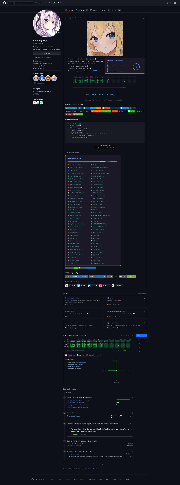
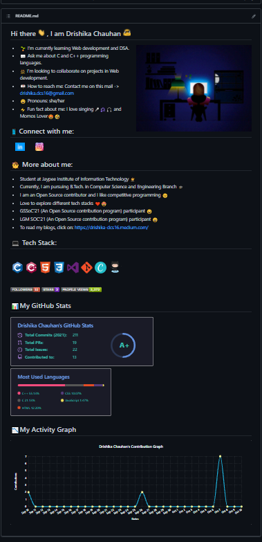
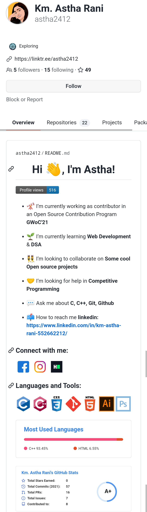
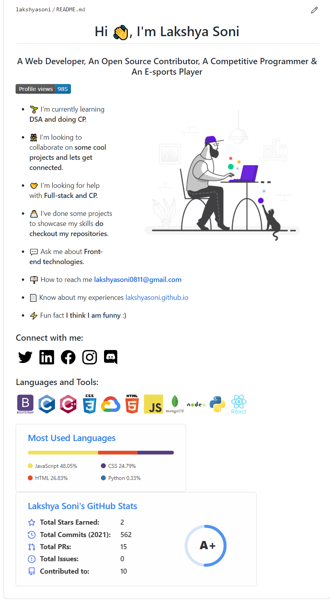
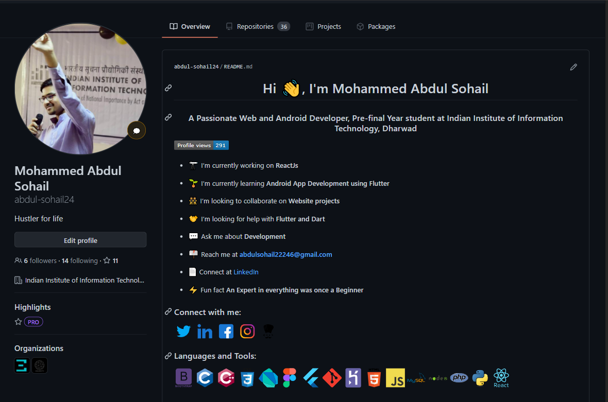

# Developer Profile

     

Curated list of Developer Github Profiles for your inspiration.

Follow this guide: [GitHub new feature to add README on your Profile ](https://dev.to/coderjojo/github-new-feature-to-add-readme-on-your-profile-ggc)

Contribute to this repository by opening a [PR](./README.md) to this repository. Refer to the [CONTRIBUTING](./README.md) file for direction.

This repository was inspired from [Developer Portfolios](https://github.com/emmabostian/developer-portfolios) github repository.

Make your Profile look good & Inspire other's. Don't forget to leave :star: if you found this helpful.

**Jump to:** [A](#a) | [B](#b) | [C](#c) | [D](#d) | [E](#e) | [F](#f) | [G](#g) | [H](#h) | [I](#i) | [J](#j) | [K](#k) | [L](#l) | [M](#m) | [N](#n) | [O](#o) | [P](#p) | [R](#r) | [S](#s) | [T](#t) | [U](#u) | [V](#v) | [W](#w) | [Y](#y) | [Z](#z)

---

## A

- [Aman Kumar Dewangan](https://github.com/amandewatnitrr)
  

    
Preview

    
  

  - [Anas Elgarhy](https://github.com/anas-elgarhy)
  

    
Preview

    
  

## B

## C

## D

- [Drishika Chauhan](https://github.com/drishika2002)
  

    
Preview

    
  

## E

## F

## G

## H

## I

## J

## K

- [Kumari Astha Rani](https://github.com/astha2412)
  

    
Preview

    
  

## L

- [Lakshya Soni](https://github.com/lakshyasoni)
  

    
Preview

    
  

## M

- [Mohammed Abdul Sohail](https://github.com/abdul-sohail24)
  

    
Preview

    
  

## N

## O

## P

## Q

## R

## S

- [Smitkumar Rathod](https://github.com/RSMIT01)
  

    
Preview

    
  

## T

## U

## V

## W

## Y

## Z
